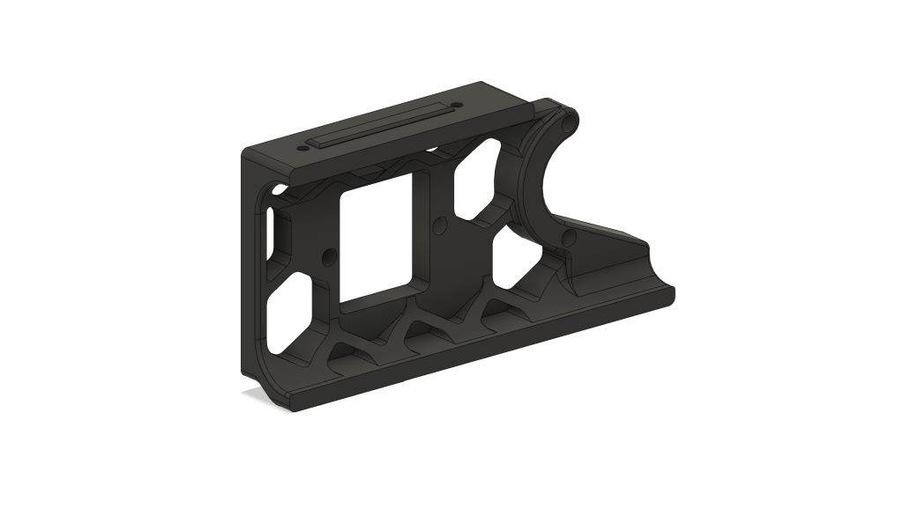
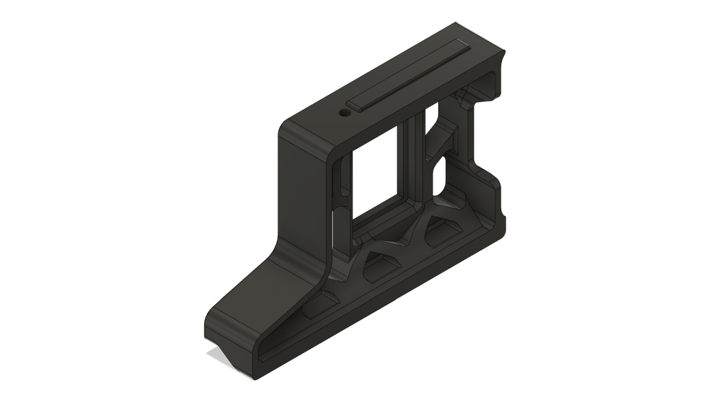
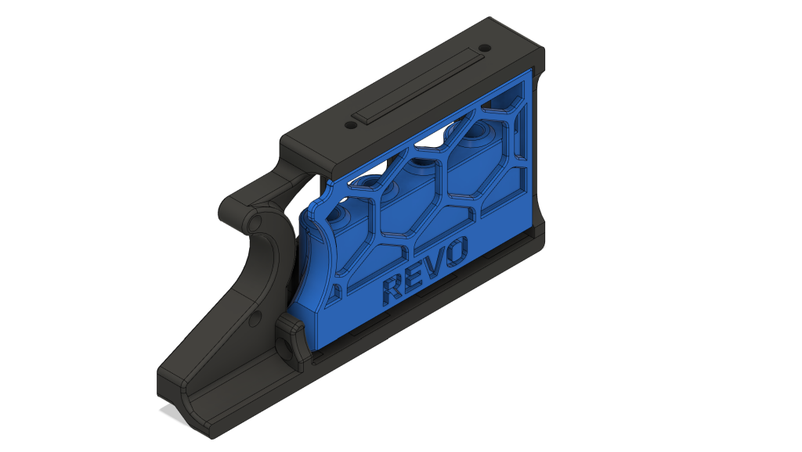
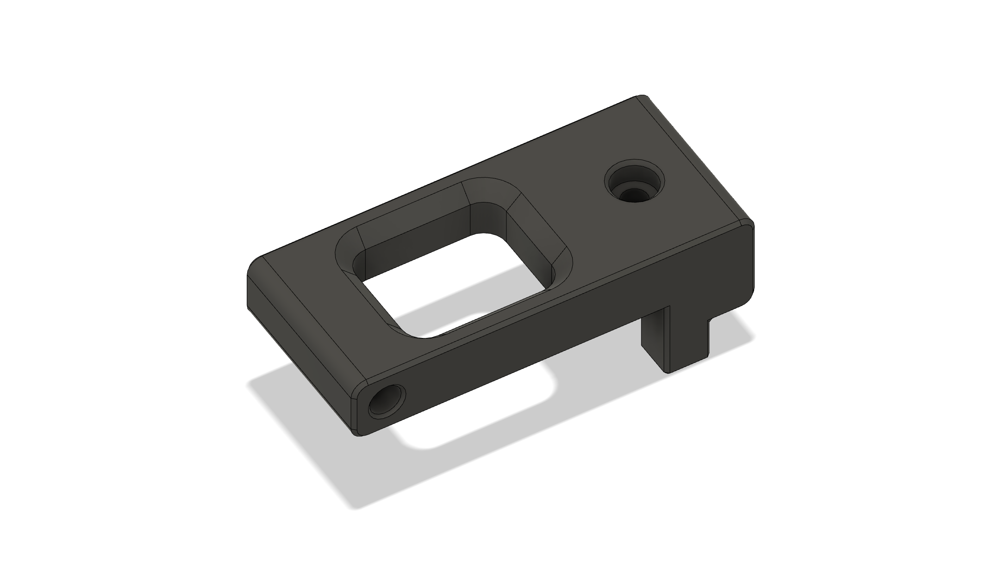
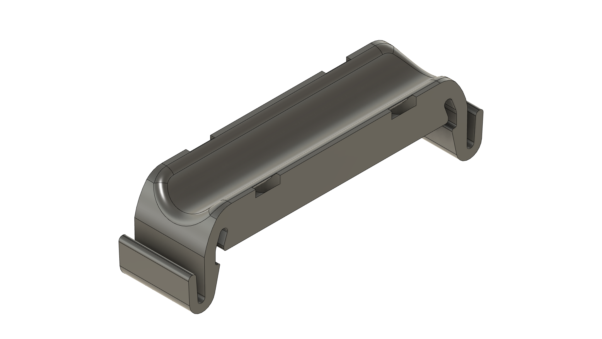

<h1 align="center">Mod Index:</h1>
<h3 align="center">Collections of my mods to Voron 2.4 - 300mm</h3>
<table align="center">
  <tr>
    <td align="center"><a href="./Rear_Skirt_Power_Inlet">Rear Skirt Power Inlet </a></td>
	<td align="center"><a href="./Side_Skirt_Power_Switch">Side Skirt Power Switch </a></td>
  </tr>
  <tr>
    <td align="center"><a href="./Revo_Nozzle_Skirt">Revo Nozzle Skirt </a></td>
    <td align="center"><a href="./Top_Mounted_Bowden_retainer">Top Mounted Bowden retainer </a></td>
  </tr>
    <tr>
    <td align="center"><a href="./Din_Rail_Ziptie_Mount">Din Rail ZipTie Mount </a></td>
    <td align="center"></td>
  </tr>
    <td colspan="2" align="center"></td>
  </tr>
  </table>
