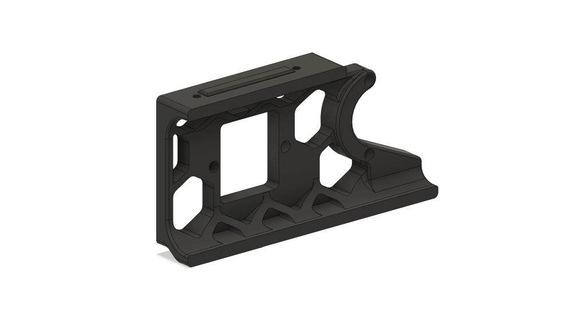
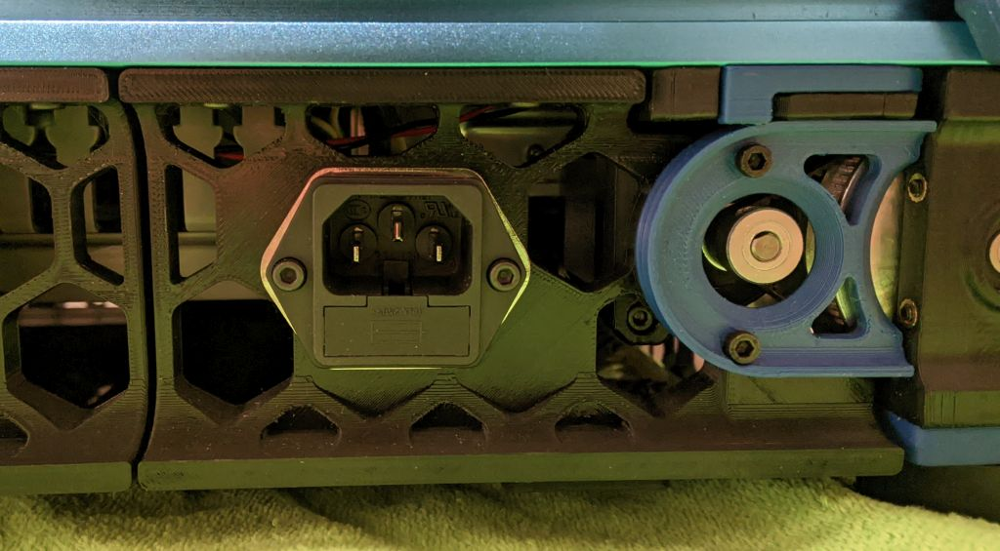
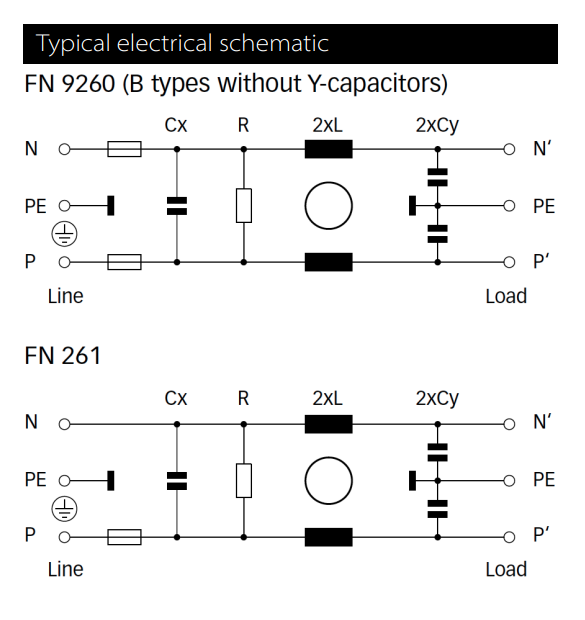

# Rear Skirt Filtered Power Inlet

Power rocker switch moved to the either left/right front side skirt of the Voron 2.4   

Compatible with 300 Voron 2.4.  

# Bill Of Materials

- 1x FN9260B-10-06 - Power Inlet with Filter (Distrelec Article Number: 301-09-731 / Manufacturer Part Number: FN9260B-10-06)
- 1x RND 170-00002 - Fuse 5 x 20mm, 10A, 250V (Distrelec Article Number: 300-43-422 / Manufacturer Part Number: RND 170-00002)(fuse is not included with the outlet)
- 5x M3 Heat-set insert
- 2x M3x8 SHCS
- 2x M3x6 BHCS (SHCS will also work)

# Instructions

- Print the skirt for the side you want to mount the filtered power inlet on.
- put the power inlet inn to the hole and fasten it with two M3x6 screws.
- insert the fuse into the power outlet 
- Remove the stock skirt piece from your Voron 2.4 and install the new one in it's place.

# Inlet info
- Rating: 10 A, 250 VAC
- Contact Configuration: 2NO
- Panel Cut Out Width: 33.3mm
- Panel Cut Out Height: 29.3mm
- Mounting Type: Screw

# Wiring Diagram

