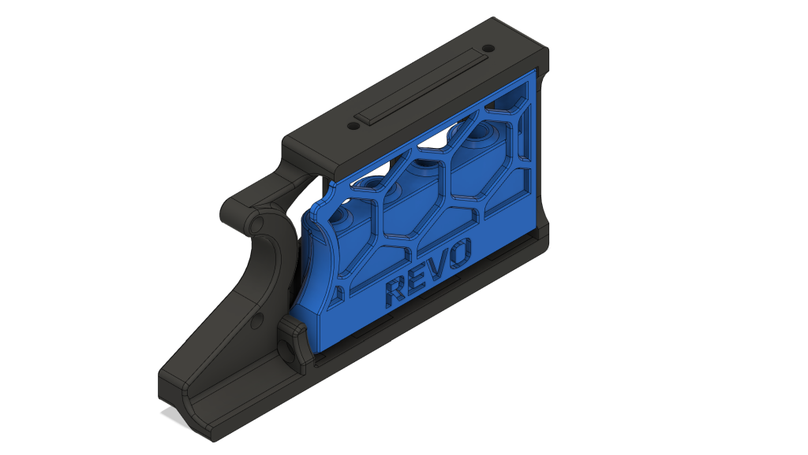
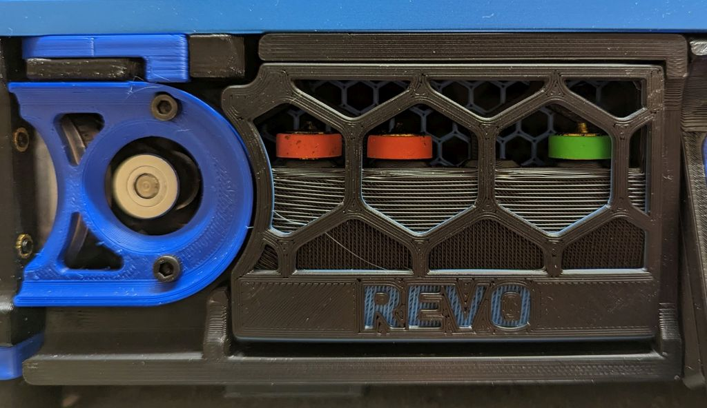
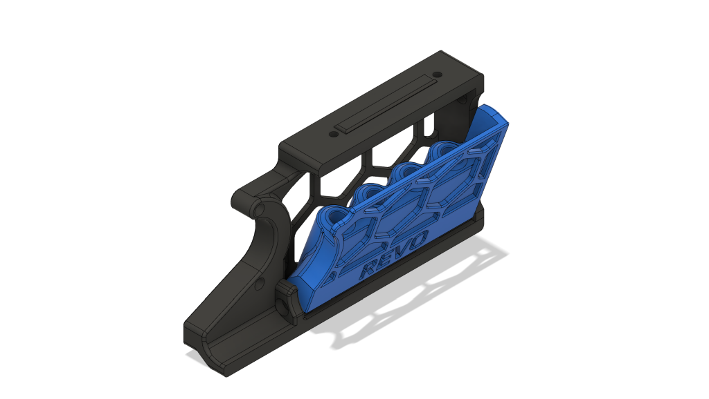
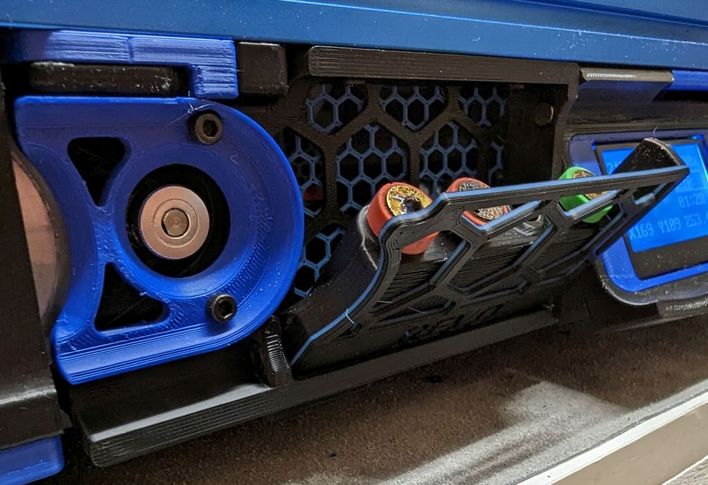

# Revo Nozzle Holder v2.4 300mm
Remix of [Andre's](https://github.com/VoronDesign/VoronUsers/tree/master/printer_mods/Andre/Revo_Nozzle_Skirt_Trident) skirt-mounted nozzle holder to fit the front skirt on Voron 2.4 300mm printers, the BOM and installation steps are the same.

This will fit up to 4 nozzles, and uses a remixed version of '300mm' nozzle holder part from Andre's design, so that it will fit the left front skirt of the V2.4.

# Bill Of Materials

- 2x 6mm x 3mm Round Magnet
- 5x M3 Heat-set insert
- 2x M3x8 SHCS

# Instructions

- Print skirt and nozzle holder parts (the skirt piece will be placed in the left front position of the printer).
- Install the 2 heat-set inserts into the ends of nozzle-holder part.
- Install 1 magnet in the skirt, and 1 in the nozzle-holder such that they attract each other when the door is installed.
- Insert the nozzle holder into the skirt and fasten with 2 M3x8 BHCS
- Remove the stock skirt piece from your v2.4 and install the new one in its place. (Note, you'll need to use an angled or ball-end hex driver to install the skirt bolt, as the installed nozzle tray makes it hard to get to).
