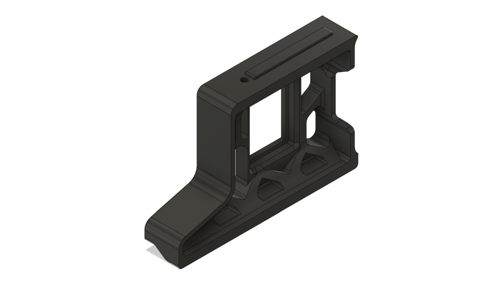
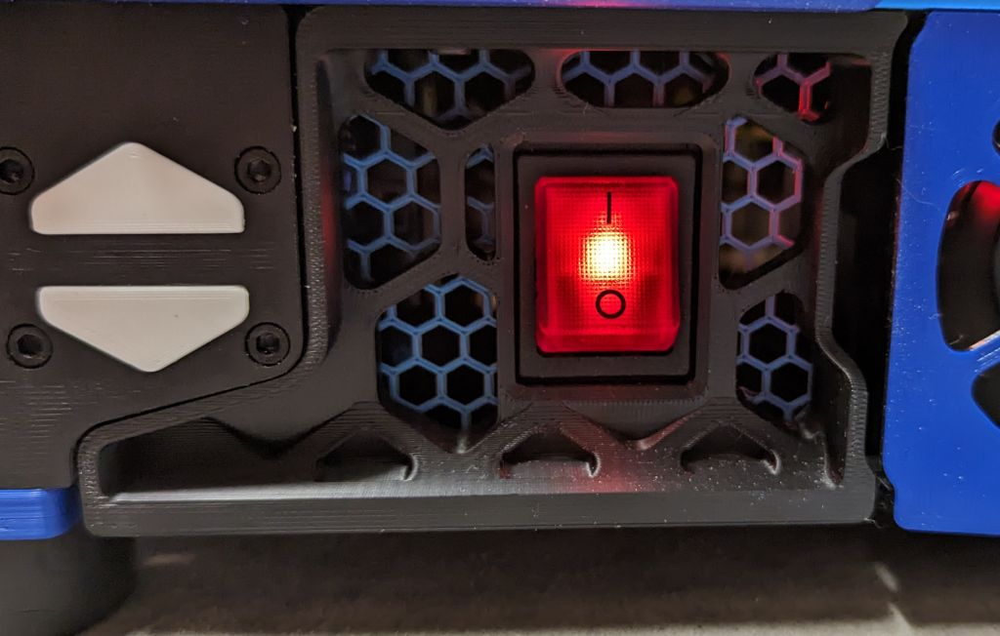
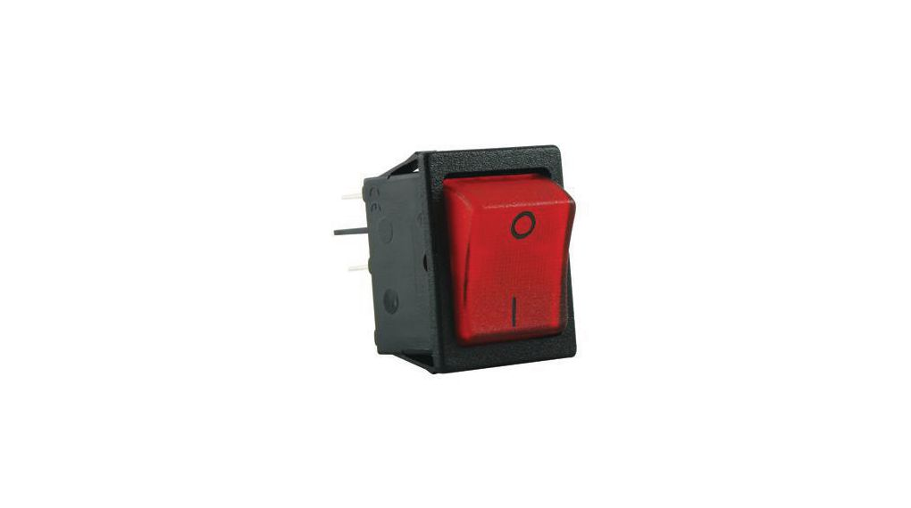
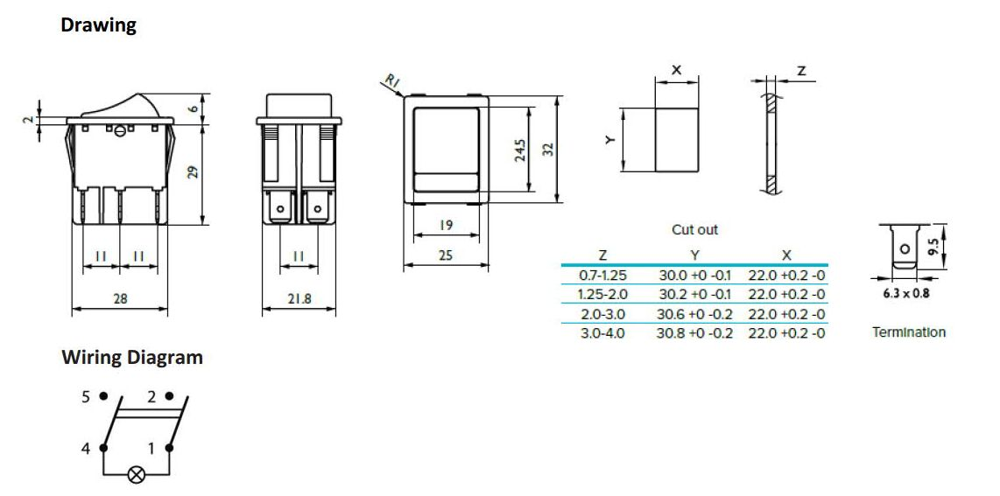

# Side Skirt Power Switch

Power rocker switch moved to the either left/right front side skirt of the Voron 2.4   

Compatible with 300 Voron 2.4.  

# Bill Of Materials

- 1x RND 210-00712 - Rocker Switch (Distrelec Article Number: 301-87-243 / Manufacturer Part Number: RND 210-00712)
- 1x M3x8 BHCS

# Instructions

- Print the skirt for the side you want to mount the rocker switch.
- press the rocker switch in place, you'll hear a click when it's in plase.
- Remove the stock skirt piece from your Voron 2.4 and install the new one in it's place.

# Rocker switch info
- Rating: 20 A, 250 VAC
- Contact Configuration: 2NO
- Panel Cut Out Width: 22mm
- Panel Cut Out Height: 30mm
- Mounting Type: Panel Mount

# Drawing / Wiring Diagram

