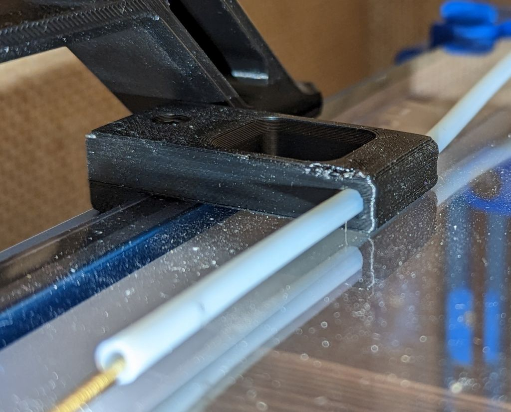
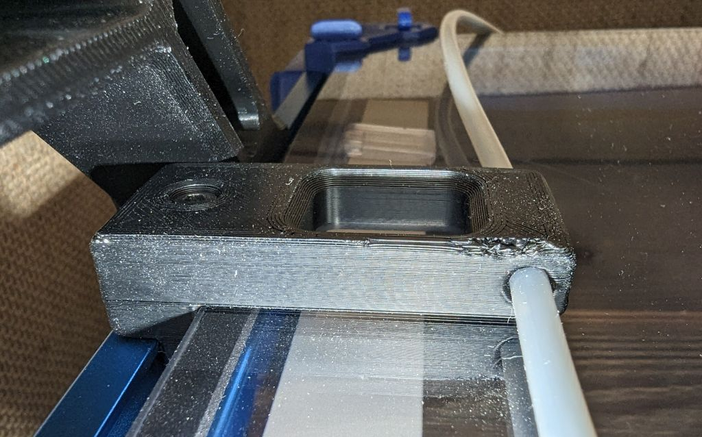

# Top mounted bowden retainer

Top mounted bowden retainer for use with top mounded spool holders  
The retainer is designed to be used on 3mm panels with 3mm foam   

# Bill Of Materials

- 1x M3x16 SHCS
- 1x M3 T-nut