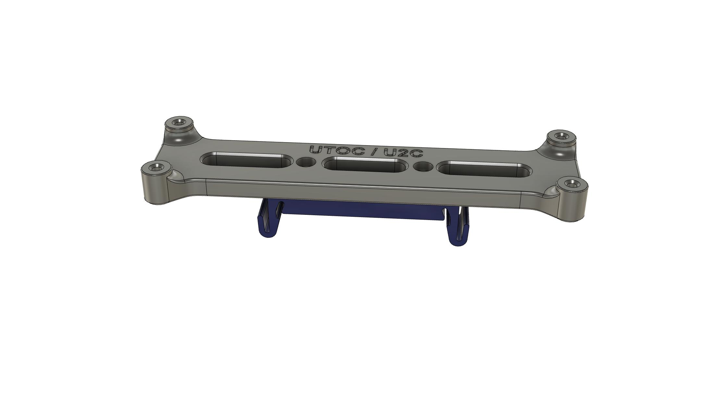
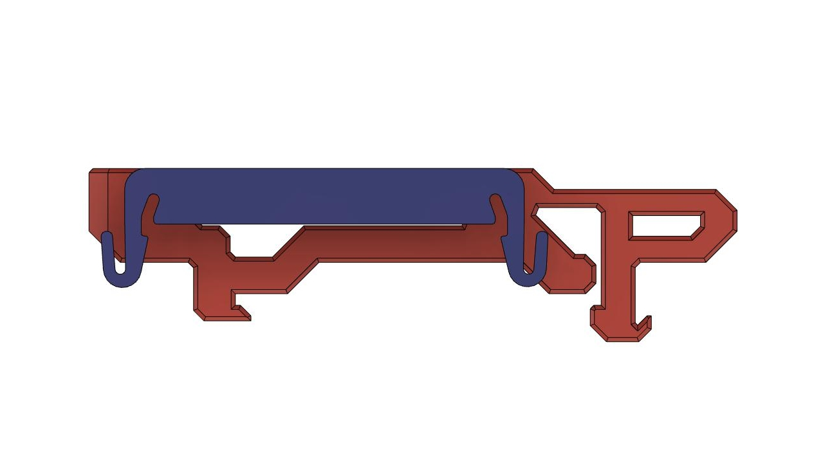
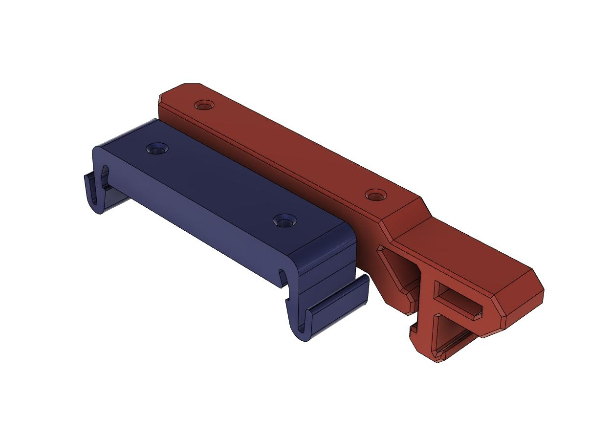

# UTOC / U3C Brackets

Brackets for either Mellows UTOC boards or Bightreetechs U2C boards

# Printing

- Default voron settings, correct orientation, no supports needed!

# BOM

- 4x M3x6 BHCS (SHCS will also work)
- 2x M2x10 Self-tapping Screw or 6 if you use the selftap version of the bracket.

# Description

- The bracket comes in 4 different versions.
- 2 off them uses M3x6 BHCS to fasten the board to the bracket, the other 2 uses M2x10 selftap screw
- The brackets can be used with either the pcb_din_clip_x3.stl that can befound in the Voron 2.4r2 repositiry or with the included Small_Din_Clip.stl
Each file have the clip type in the filename (Small_Din_Clip or Voron_Din_Clip).
- The small DIN clip is quite bit smaller in foot print then the one that comes with the Voron 2.4, but it snaps to the DIN rail quite well and sits firm on ut.

# DIN Clip pictures

